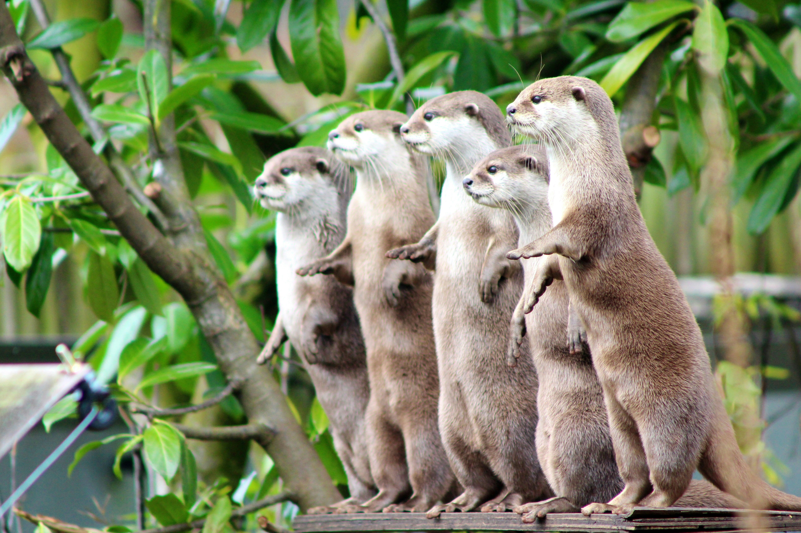
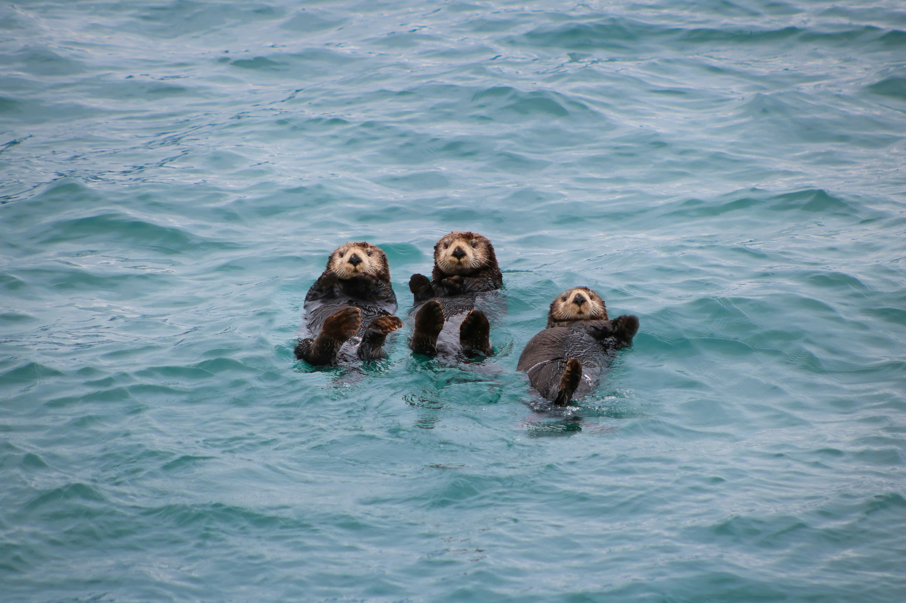

## {background-image="img/redpanda.jpg"}

::: {.absolute top="0%" left="5%" style="font-size:1.2em; padding: 0.5em 1em; background-color: rgba(255, 255, 255, .5); backdrop-filter: blur(5px); box-shadow: 0 0 1rem 0 rgba(0, 0, 0, .5); border-radius: 5px;"}

::: {.bigger style="font-size:2em"}

Teaching R with R

:::

::: {.bigger style="font-size:1.3em"}

How to get started doing lectures with Quarto and reveal.js

:::

Håvard R. Karlsen, NTNU -- date: 2026-07-09

:::

## Introduction 

:::: {.columns}

::: {.column width="50%"}

Håvard R. Karlsen

- Associate professor of personality psychology and psychometrics at the Norwegian University of Science and Technology (NTNU). 
- Teaches practical skills in R in [PSY3202 - Knowledge in Practice 2: Project Work in Data Management and Interdisciplinary Communication](https://www.ntnu.edu/studies/courses/PSY3202).

### Today 

*One of **many** ways to create slides*.

:::

::: {.column width="50%"}

### Tools

- **RStudio** to make slides. 
- **Quarto** documents, with 
- **reveal.js** to make the presentations. Present slides through
- **Google Chrome**/**Chromium** for best experience. 

Assumed knowledge not covered here: The basics of reveal.js slidecrafting. See [The Quarto docs guide on reveal.js](https://quarto.org/docs/presentations/revealjs/).


:::

::::

## To make the slides use the entire screen

A common problem: images move or change size, or slide don't fill the available screen real estate. 

$$
\text{Aspect ratio} = \frac{\text{width}}{\text{height}}
$$

- Default: $\frac{1050}{700} = 1.5$

- My laptop: $\frac{1050}{682.26} = 1.539$

Make sure you have the right aspect ratio defined in the YAML. 

```{yaml filename = "yaml"}
format: 
  revealjs:
    height: 682.26
```

## Relative positioning

**Relative positioning**: Loosely define placement in slide. Hard to control, but works across file formats (reveal.js, beamer, etc.) and aspect ratios.

```
{fig-align="right" height=300}
```

{fig-align="right" height=300}

::: aside 

Photo by [Emily Nelson](https://unsplash.com/@nelson_96) on [Unsplash](https://unsplash.com/photos/group-of-animals-on-tree-branch-during-daytime-O0sa7pu4xTE)

::: 

See [Emil Hvitfeldts post about slidecrafting](https://emilhvitfeldt.com/post/slidecraft-layout/) or his [book on the same subject](https://slidecrafting-book.com/) for more tips.

::: {.notes}
Need both height and width. With only widht, no image. With only height, image is only one size. With both, only width will change the size.
:::

## Absolute positioning


:::: {.columns}

::: {.column width="40%"}

**Absolute positioning**: Full control of placement, but often breaks in other formats or aspect ratios. 

```
{.absolute top="-10%" right="-40%" height="100%"}
```


:::

::: {.column width="60%"}


:::

::::

{.absolute top="-10%" right="-40%" height="100%"}

Do note that the text will not respect the image with absolute positioning so that you might get overlaps. 

*To avoid overlap, use columns.*

::: aside

Photo by [Kedar Gadge](https://unsplash.com/@kedar9) on [Unsplash](https://unsplash.com/photos/a-group-of-sea-otters-swimming-in-the-ocean-X9cBHEPO6LU)

::: 

## Columns helps you maximise your screen real estate


:::: {.columns}

::: {.column width="48%"}

Example of use. This is column 1. Tweak the widths to accomodate images or code chunks.

{width=70%}


```{r}
# What day of the week is it?
lubridate::wday("2026-07-09", label = TRUE)
```


:::

::: {.column width="52%"}

And this is column 2. 

```
:::: {.columns}

::: {.column width="48%"}

Example of use. This is column 1. Tweak the widths to accomodate images or code chunks.

{width=70%}

```

  ```
  # What day of the week is it?
  lubridate::wday("2026-07-09", label = TRUE)
  ```

```
:::

::: {.column width="52%"}

And this is column 2. 

:::

::::
```

:::

::::

::: aside

Photo by [Hans Veth](https://unsplash.com/@hans_veth) on [Unsplash](https://unsplash.com/photos/white-and-black-animal-on-brown-soil-YGMyrU2sjUk).

:::

## Display and run code: My two approaches

1. For simple, one line pieces of code or a small pipeline: Open up a script and do some live coding. Prepare a script beforehand to look at. Allows students to copy off the screen.
2. For longer pieces of code: Use **fragments** to show the code, and then the output, staggered. 

::: {.callout-tip}

To showcase faulty code, remember to set `eval: false` in chunk options or YAML to avoid it breaking the rendering.

:::


## Using fragments

**Fragments** reveal parts of the slide gradually. Can be [stylised extensively](https://quarto.org/docs/presentations/revealjs/advanced.html#fragments).

:::: {.columns}

::: {.column width="50%"}

### Code

```default
#| output-location: fragment

library(tidyverse)

penguins |> 
  filter(species == "Gentoo") |> 
  group_by(sex) |> 
  summarise(
    body_mass_m = mean(body_mass, 
                       na.rm = TRUE),
    body_mass_sd = sd(body_mass, 
                      na.rm = TRUE))
```

:::

::: {.column width="50%"}

### Presentation

Task: use filter out Gentoo penguins and display a summary of body mass. 


```{r}
#| output-location: fragment

library(tidyverse)

penguins |> 
  filter(species == "Gentoo") |> 
  group_by(sex) |> 
  summarise(
    body_mass_m = mean(body_mass, 
                       na.rm = TRUE),
    body_mass_sd = sd(body_mass, 
                      na.rm = TRUE))
```

:::

::::


## Exercise sheet with answers

To avoid tedious copy-pasting of answer sheets for exercises, use parameters. 

Define a YAML parameter `hide_answers` that is `true/false`. Wrap the code in a hide content div (`:::`) with R code (`if`) conditional on the parameter.

How this looks in practice: 

```{yaml filename="yaml"}
params: 
  hide_answers: true
```

In your presentation slide: 

```{default filename="slide"}
`r if (params$hide_answers) "::: {.content-hidden}"`

[Some code]

`r if (params$hide_answers) ":::"`
```

## With `hide_answers = true`

### Exercise 1
  
The Palmer penguins dataset has measured penguins' properties in mm. Turn the measurements into cm. 

## With `hide_answers = false`

### Exercise 1
  
The Palmer penguins dataset has measured penguins' properties in mm. Turn the measurements into cm. 

:::: {.columns}

::: {.column width="75%"}

### Answer
  
```{r}

library(tidyverse)

penguins |> 
  mutate(
    across(c(bill_len, bill_dep, flipper_len),
           \(x) x / 10 )
  ) |> 
  head()
```

:::

::: {.column width="25%"}

::: {.fragment}

Render the documents once with each parameter value (`true/false`) for both versions.

- Based on [Nicola Rennie's post](https://nrennie.rbind.io/blog/r-tutorial-worksheets-quarto/).
- More at [Quarto docs](https://quarto.org/docs/authoring/conditional.html).

:::


:::

::::


# <span style="color: white;">Example of a nice section divider slide</span> {background-image="img/raccoon.jpg"}

## Nice section dividers

To produce a slide that acts as a divider, use some html: 

```html
# <span style="color: white;">Example of a nice section 
divider slide</span> {background-image="img/raccoon.jpg"}
```

::: aside
Photo by <a href="https://unsplash.com/@photosimon?utm_source=unsplash&utm_medium=referral&utm_content=creditCopyText">Simon Infanger</a> on <a href="https://unsplash.com/photos/animal-on-tree-branch-hgdh6IwKi7Y?utm_source=unsplash&utm_medium=referral&utm_content=creditCopyText">Unsplash</a>
:::

## Styling/theming with scss

Apply a consistent style across all slides with scss. Create e.g. `mytheme.scss` and link it in the YAML. Helpful for text size, colours, defaults. 

### YAML

```{yaml filename="slides.qmd"}
format: 
  revealjs:
    theme: mystyle.scss
```

### Content of mystyle.scss

```{.scss filename="mystyle.scss"}
$body-color: #000 !default;
$presentation-font-size-root: 28px; /* Reduce the base text size */
$link-color: #689f38;
```

*Check out mystyle.scss for more settings I have tweaked here.* 

## Creating hand-outs: Printing the slideshow

Common problem: the canvas shifts, jumbling and/or removing text and images. 

1. Make sure the aspect ratio matches your screen.
2. Render the slideshow.
3. Open it in the Chrome browser.
4. Press `e` to enter print mode.
5. Print to pdf with the browser's built-in print function (`cmd + p`).


## {background-image="img/polarfox.jpg"}

::: {.absolute top="0%" left="0%" style="font-size:2em; color:white;"}

Concluding tips

::: 

::: {.absolute top="60%" style="font-size:0.8em; padding: 0.5em 1em; background-color: rgba(255, 255, 255, .5); backdrop-filter: blur(5px); box-shadow: 0 0 1rem 0 rgba(0, 0, 0, .5); border-radius: 5px;"}

:::: {.columns}

::: {.column width="50%"}

- Experiment a little bit every time you make a new presentation.
- Make notes of your findings to re-use them later.
- Read blogs from the R Community -- lots of tips there.
- Have fun!

:::

::: {.column width="50%"}

This presentation and all relevant materials can be found at [GitHub](https://github.com/HDkarlsen/teachingR){style="color:blue;"}. Feel free to use it as an inspiration for your next slides. 

::: {.fragment}

*Thank you for your attention!*

:::

::: {.smaller style="font-size:0.6em"}

Photo by [Jonatan Pie](https://unsplash.com/@r3dmax){style="color:blue;"} on
[Unsplash](https://unsplash.com/photos/gray-and-white-fox-on-top-of-mountain-vOVXTRXbApg){style="color:blue;"}.

::: 

:::

::::

:::

